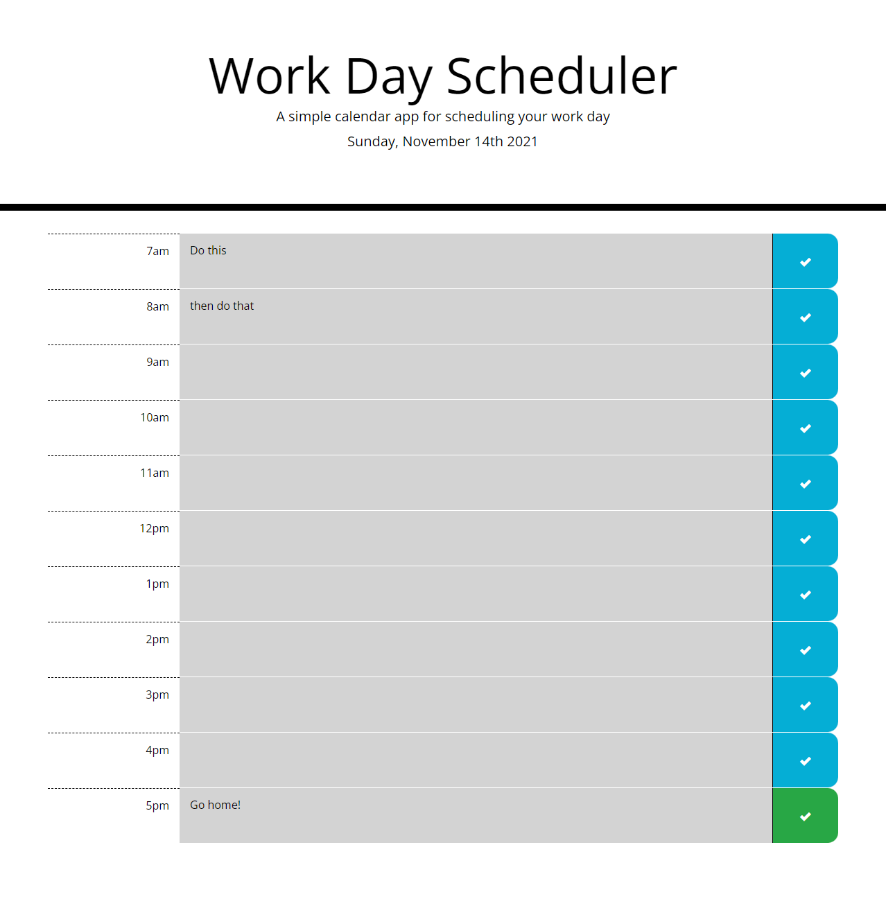

# Work Day Scheduler Starter Code

## Welcome

Use this tool to help plan out your daily routine!

Features include:

-   Dynamically create and edit tasks for every hour of the standard work day
-   Stay updated on the current task as past, present, and future events are color coded
-   Save your data so you can close the web page and come back later without losing any information

[Click here to check it out!](https://kelerik.github.io/Challenge-WorkDayScheduler/)

Preview:

